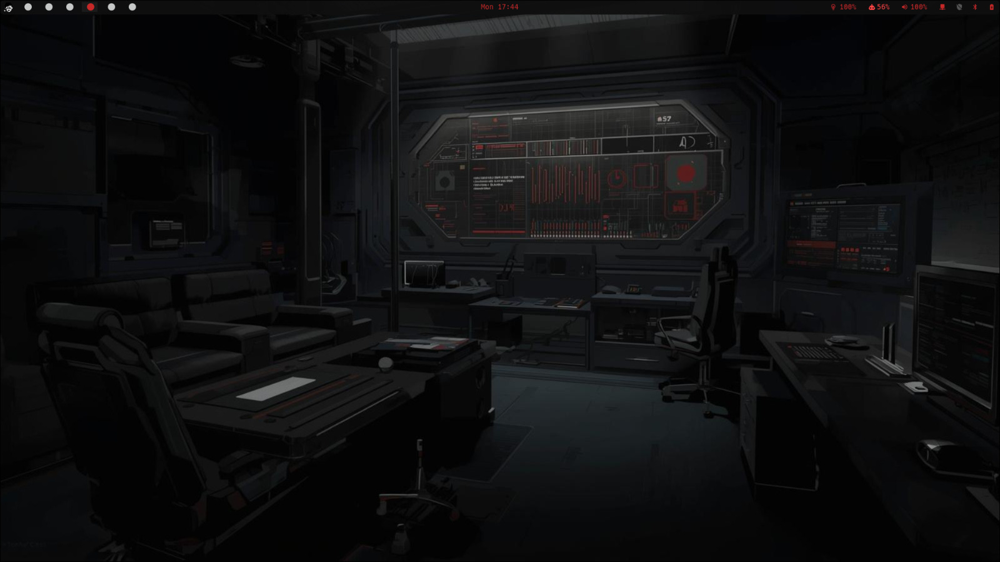
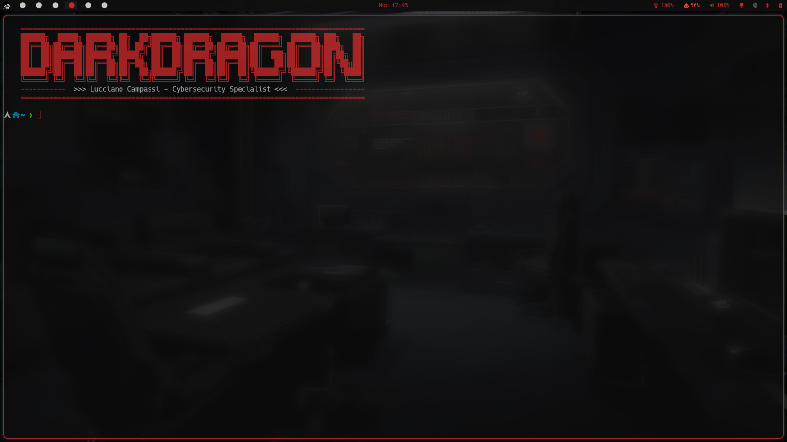
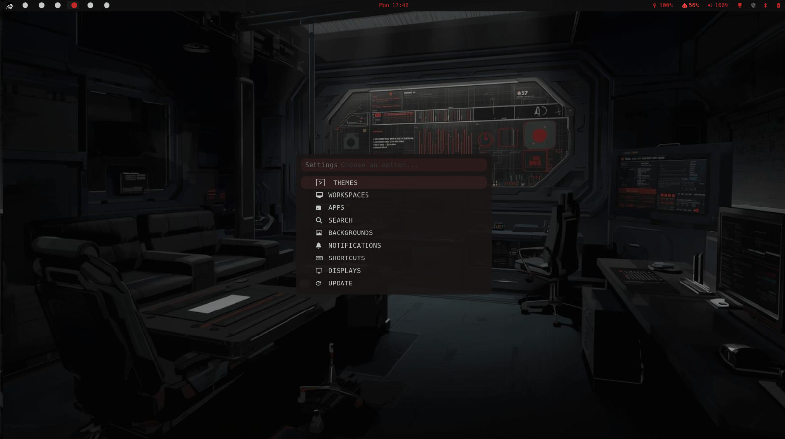
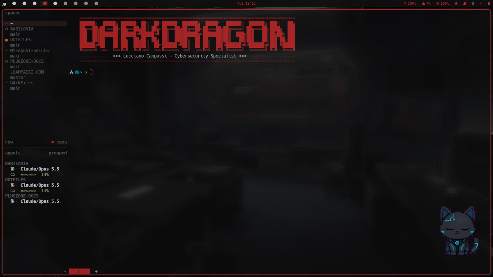
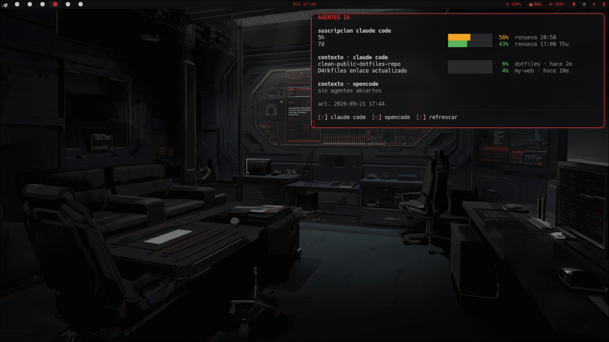

<div align="center">
<table>
<tr>
<td valign="middle"></td>
<td valign="middle">
<pre>
██████╗  █████╗ ██████╗ ██╗  ██╗██████╗ ██████╗  █████╗  ██████╗  ██████╗ ███╗   ██╗
██╔══██╗██╔══██╗██╔══██╗██║ ██╔╝██╔══██╗██╔══██╗██╔══██╗██╔════╝ ██╔═══██╗████╗  ██║
██║  ██║███████║██████╔╝█████╔╝ ██║  ██║██████╔╝███████║██║  ███╗██║   ██║██╔██╗ ██║
██║  ██║██╔══██║██╔══██╗██╔═██╗ ██║  ██║██╔══██╗██╔══██║██║   ██║██║   ██║██║╚██╗██║
██████╔╝██║  ██║██║  ██║██║  ██╗██████╔╝██║  ██║██║  ██║╚██████╔╝╚██████╔╝██║ ╚████║
╚═════╝ ╚═╝  ╚═╝╚═╝  ╚═╝╚═╝  ╚═╝╚═════╝ ╚═╝  ╚═╝╚═╝  ╚═╝ ╚═════╝  ╚═════╝ ╚═╝  ╚═══╝
</pre>
</td>
</tr>
</table>

<h1>D4rkFiles</h1>
<sub>por <a href="https://github.com/D4rkDr4gon">D4rkDr4gon</a></sub>
</div>

Dotfiles de Arch Linux con dos sesiones —**Hyprland** (Wayland) y **Qtile** (X11)— y un
motor de temas: cambiás de tema y cambian a la vez el borde de las ventanas, waybar, rofi,
kitty, dunst, Neovim, Firefox, la pantalla de login y unas veinte cosas más.

Está pensado para que **cualquiera lo instale**: no asume usuario, ruta de clone, monitores,
teclado, batería ni GPU. Lo tuyo (nombre, apps, atajos propios) vive fuera del repo.

## Capturas

Tema por defecto (`red-dark`) en Hyprland.

<p align="center">

</p>

<table>
<tr>
<td></td>
<td></td>
</tr>
</table>

<table>
<tr>
<td></td>
<td></td>
</tr>
</table>

## Instalación

```bash
git clone https://github.com/D4rkDr4gon/D4rkFiles.git
cd D4rkFiles
./install.sh --dry-run     # ver qué haría, sin tocar nada
./install.sh
```

O en una línea: `bash <(curl -fsSL https://raw.githubusercontent.com/D4rkDr4gon/D4rkFiles/main/install.sh)`.

Es idempotente y **no borra nada**: lo que reemplaza queda en
`~/.local/state/dotfiles/backups/<fecha>/`. Detalles y opciones en [docs/installation.md](docs/installation.md).

## Primeros pasos

```bash
theme                 # lista los 17 temas
theme nord            # aplica uno
scripts/dotfiles-doctor.sh   # verifica la instalación
```

`Super+Return` terminal · `Super+Space` buscador · `Super+Shift+Space` Settings ·
`Super+K` todos los atajos ([docs/keybindings.md](docs/keybindings.md)).

Tu nombre y título (banner de la terminal, pantalla de bloqueo, login de SDDM y saludo) se
configuran en `~/.config/dotfiles/user.conf`; el instalador te los pregunta.

## Stack

| Área | Hyprland (Wayland) | Qtile (X11) |
|---|---|---|
| WM | Hyprland + hyprpaper + hyprshell | Qtile + picom |
| Barra | waybar | polybar |
| Launcher | rofi (+ walker/elephant) | rofi |
| Bloqueo / login | gtklock · SDDM | betterlockscreen / i3lock · SDDM |
| Común | kitty · zsh + powerlevel10k · dunst · Neovim (LazyVim) · herdr · lazygit · Thunar | |

## Skill de IA

El instalador deja lista la skill **`d4rkfiles`** para [Claude Code](https://claude.com/claude-code) y
[opencode](https://opencode.ai): le pedís en lenguaje natural "cambiá al tema nord", "configurá mis
monitores", "agregá este atajo", "actualizá el sistema" o "¿por qué no anda waybar?" y sabe dónde está cada
cosa, cómo cambiarla sin romper nada y cómo recargarla. Ver [docs/ai-skill.md](docs/ai-skill.md).

## Personalizar

Tu configuración vive en `~/.config/dotfiles/` (`user.conf`, overrides de Hyprland,
`local.zsh`), así `git pull` nunca choca con tus cambios.
Ver [docs/customization.md](docs/customization.md).

## Documentación

Toda la documentación está en la **[wiki](https://github.com/D4rkDr4gon/D4rkFiles/wiki)**. Su fuente es [`docs/`](docs/): se edita ahí y un workflow la publica en la wiki en cada push a `main`.

| Página | Contenido |
|---|---|
| [Instalación](https://github.com/D4rkDr4gon/D4rkFiles/wiki/Instalación) | Opciones, etapas, paquetes, backups, desinstalar |
| [Personalización](https://github.com/D4rkDr4gon/D4rkFiles/wiki/Personalización) | `user.conf`, monitores, wallpapers, alias propios |
| [Estructura](https://github.com/D4rkDr4gon/D4rkFiles/wiki/Estructura) | Layout del repo y archivos generados |
| [Temas](https://github.com/D4rkDr4gon/D4rkFiles/wiki/Temas) | Motor de temas, `theme.json`, plantillas, crear un tema |
| [Sistema de diseño](https://github.com/D4rkDr4gon/D4rkFiles/wiki/Sistema-de-diseño) | Reglas de diseño compartidas |
| [Atajos](https://github.com/D4rkDr4gon/D4rkFiles/wiki/Atajos) | Atajos de Hyprland, Qtile, kitty y herdr |
| [Componentes](https://github.com/D4rkDr4gon/D4rkFiles/wiki/Componentes) | Qué hace cada pieza |
| [Scripts](https://github.com/D4rkDr4gon/D4rkFiles/wiki/Scripts) | Herramientas: doctor, update, theme, gen-assets… |
| [Seguridad](https://github.com/D4rkDr4gon/D4rkFiles/wiki/Seguridad) | Qué no se versiona y dónde van tus credenciales |
| [Skill de IA](https://github.com/D4rkDr4gon/D4rkFiles/wiki/Skill-de-IA) | La skill `d4rkfiles` para Claude Code y opencode |
| [Problemas frecuentes](https://github.com/D4rkDr4gon/D4rkFiles/wiki/Problemas-frecuentes) | Problemas frecuentes |

## Licencia

MIT — ver [LICENSE](LICENSE).
